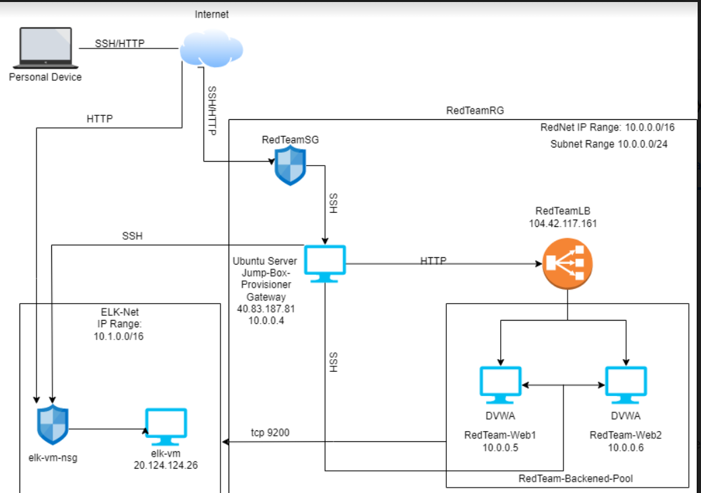
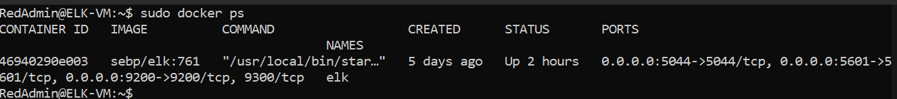

## Automated ELK Stack Deployment

The files in this repository were used to configure the network depicted below.

[Network Diagram Link] https://github.com/RussellGerfen/Bootcamp-Projects/blob/e25bf262c173438e022b59deaa56e0c22eefdb82/Diagrams/Azure-Lab-Environment.png

These files have been tested and used to generate a live ELK deployment on Azure. They can be used to either recreate the entire 
deployment pictured above. Alternatively, select portions of the playbook file may be used to install only certain pieces of it, such as Filebeat.

This document contains the following details:
- Description of the Topology
- Access Policies
- ELK Configuration 
  - Beats in Use
  - Machines Being Monitored
- How to Use the Ansible Build

### Description of the Topology

The main purpose of this network is to expose a load-balanced and monitored instance of DVWA, the D*mn Vulnerable Web Application.

Load balancing ensures that the application will be highly accessible, in addition to restricting traffic to the network.
Jump box helps automate the configuration process for other virtual machines.

Integrating an ELK server allows users to easily monitor the vulnerable VMs for changes to the log data and system files.

The configuration details of each machine may be found below.
_Note: Use the [Markdown Table Generator](http://www.tablesgenerator.com/markdown_tables) to add/remove values from the table_.

|        Name          |       Function         |   IP Address   |  OS   |
|----------------------|------------------------|----------------|-------|
| Jump-Box-Provisioner | Gateway                | 40.83.187.81   | Linux |
| ELK-VM               | Search & Log Analytics | 20.124.124.26  | Linux |
| RedTeam-Web1         | DVWA Web Server        | 104.42.117.161 | Linux |
| RedTeam-Web2         | DVWA Web Server        | 104.42.117.161 | Linux |

### Access Policies

The machines on the internal network are not exposed to the public Internet. 

Only the LoadBalancer machine can accept connections from the Internet. Access to this machine is only allowed from the following IP addresses: 40.83.187.81

Machines within the network can only be accessed by Jump-Box-Provisioner: 40.83.187.81

A summary of the access policies in place can be found in the table below.

| Name                 | Publicly Accessible | Allowed IP Addresses |
|----------------------|---------------------|----------------------|
| Jump-Box-Provisioner | Yes                 | My-Personal-IP       |
| ELK-VM               | No                  | 40.83.187.81         |
| RedTeam-Web1         | No                  | 40.83.187.81         |
| RedTeam-Web2         | No                  | 40.83.187.81         |

### Elk Configuration

Ansible was used to automate configuration of the ELK machine. No configuration was performed manually, which is advantageous because... 
It was a simple set up, no special skills are required to use and configure machines with an Infastructor as Code file.

The install Elk playbook implements the following tasks:
- _TODO: In 3-5 bullets, explain the steps of the ELK installation play. E.g., install Docker; download image; etc._
- Identifies Hosts/targets
- Installs Docker.io to be the container we are using.
- Installs python3-pip so machine doesn't have to find its own version to download.
- Increases virtual memory to ensure accessibility for machine space.
- 

The following screenshot displays the result of running `docker ps` after successfully configuring the ELK instance.

### Target Machines & Beats
This ELK server is configured to monitor the following machines:
RedTeam-Web1   10.0.0.5
RedTeam-Web2   10.0.0.4

We have installed the following Beats on these machines:
Filebeat and Metricbeat.

These Beats allow us to collect the following information from each machine:
- _TODO: In 1-2 sentences, explain what kind of data each beat collects, and provide 1 example of what you expect to see. E.g., `Winlogbeat` collects Windows logs, which we use to track user logon events, etc._
Filebeat: Collects Log data. Shows events done on machines, how many visitors visited the site and the locations they are from and what errors they received.
Metricbeat: 

### Using the Playbook
In order to use the playbook, you will need to have an Ansible control node already configured. Assuming you have such a control node provisioned: 

SSH into the control node and follow the steps below:
- Copy the config and playbook files to jump box.
- Update the config files to include Kibana and elastisearch host ip and port number.
- Run the playbook, and navigate to Elk server ip/kibana url to check that the installation worked as expected.

_TODO: Answer the following questions to fill in the blanks:_
- _Which file is the playbook? Where do you copy it?_
- _Which file do you update to make Ansible run the playbook on a specific machine? How do I specify which machine to install the ELK server on versus which to install Filebeat on?_
- _Which URL do you navigate to in order to check that the ELK server is running?

_As a **Bonus**, provide the specific commands the user will need to run to download the playbook, update the files, etc._

